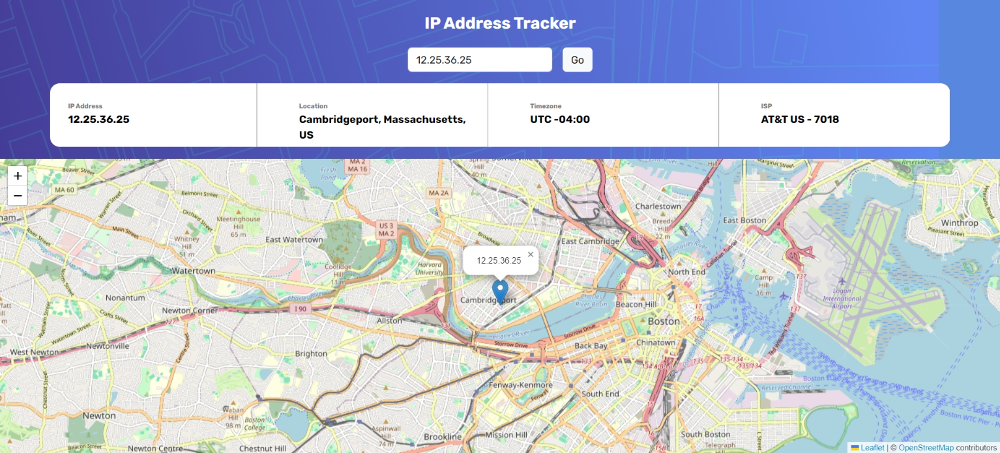

# Frontend Mentor - IP address tracker

# IP Address Tracker
IP Address Tracker is a web application that allows users to track the geolocation of any IP address or domain. It provides detailed information about the IP address's location, including city, country, timezone, and ISP. Additionally, it displays the location on an interactive map.

## Features
Track the geolocation of any IP address or domain.
Display detailed information about the location, including city, country, timezone, and ISP.
View the location on an interactive map.

## Technologies Used
* HTML
* CSS
* JavaScript
* Leaflet.js - an open-source JavaScript library for interactive maps
* ipify API - an IP address lookup API

## Usage
* Enter an IP address or domain in the search field.
* Click the "Go" button.
* The application will fetch the geolocation data and display it on the dashboard.
* The map will also update to show the location of the entered IP address.
## Contributing
Contributions are welcome! Please feel free to submit a pull request or open an issue for any bugs, feature requests, or suggestions.